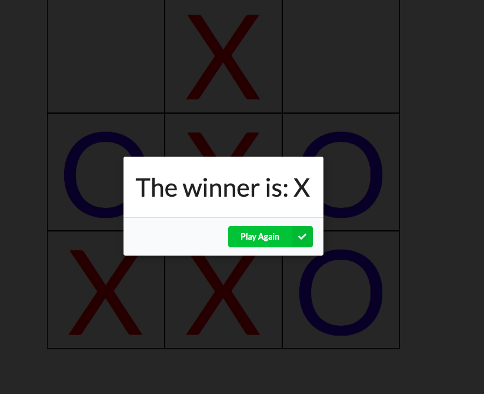
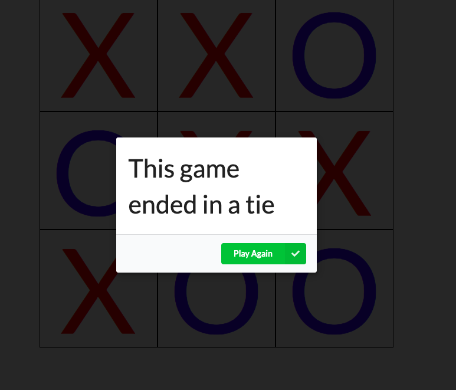

# Tic Tac Toe

Date Created: 02/06/20 | Date Modified: 02/06/20

*This assignment is an exercise: [Directions here](directions.md)*

*This assignment uses React: [Directions on how to run app](directions.md)*

Preview assignment here: https://trinity-tic-tac-toe.netlify.com/

***

## Description
- This application is a two player Tic-Tac-Toe Game
- Players decide who goes first, that player will me "X", the other player will be "O"
- Players take turn placing a shape on the board
- First player to get three of their shapes in a row, wins the game

## Features
- At the end of a game, a modal will show the results

- The Winner is announced once the game is won

- It will announce if the game ended in a tie

- If the Play again button is pressed, the board will be cleared for another game. 

